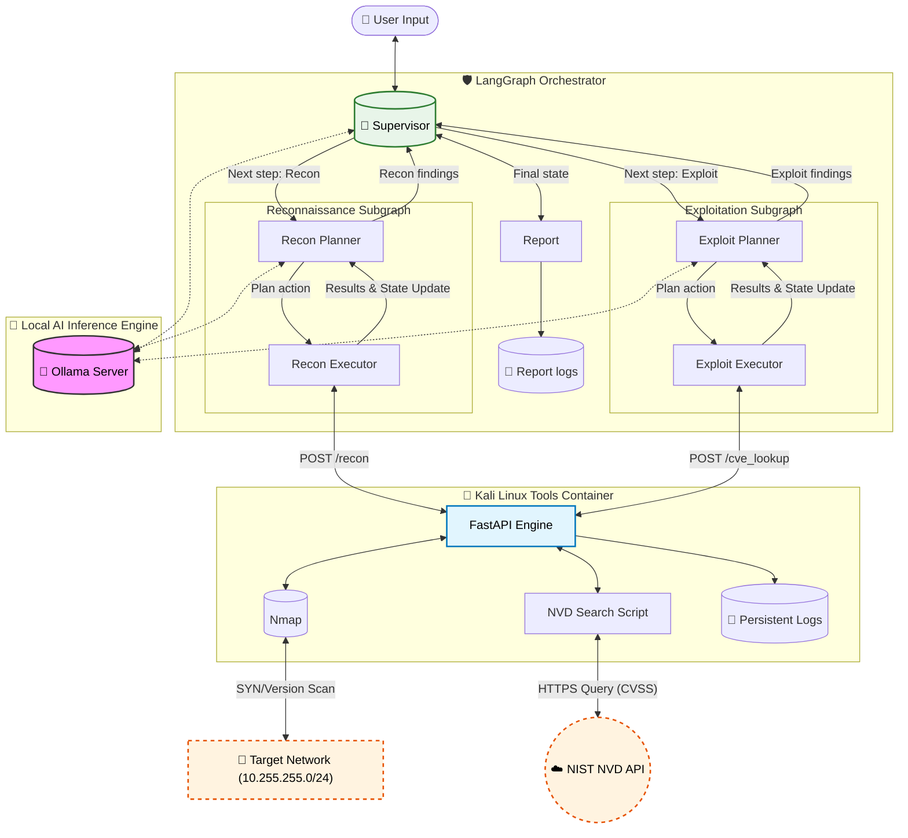

# Agentic Security Orchestrator

An AI‑driven, containerized, multi‑agent cyber‑security framework built using **LangGraph**, **Ollama**, and a modular *supervisor/worker/executor* architecture.

This project provides a controlled environment where AI agents autonomously perform:

*   **Reconnaissance**
*   **Scanning**
*   **Service fingerprinting**
*   **Structured reasoning**
*   **(Soon) Exploitation workflows**
*   **Final Report Generation**

All operations occur inside a fully isolated Docker network using a hardened Kali engine.

***

## 🚀 Overview

The system uses **LangGraph subgraphs** to coordinate separate reasoning loops for:

*   **Reconnaissance** — network scanning, host discovery, port mapping, service versioning.
*   **(WIP) Exploitation** — safe, controlled follow-up actions based on recon findings.

A central **Supervisor Agent** coordinates the workflow:

    User → Supervisor → Recon Subgraph → Supervisor → Exploit Subgraph → Supervisor → Report → Supervisor → User

### Graphic representation



***

## 🧱 Architecture

### **1. Orchestrator (main agent environment)**

Runs:

*   LangGraph supervisor
*   Worker planner(s)
*   Message/step routing
*   Nmap summary parsing
*   Structured LLM calls to perform recon/exploit decisions
*   Final report generation with findings

### **2. Kali Engine (Recon + Exploit tools)**

A hardened container that:

*   Executes Nmap, DNS, banner-grabs
*   Applies **dynamic egress firewalling** to ensure:
    *   Only target hosts are reachable
    *   Gateway and self are blocked
*   Receives tool execution requests via REST (`/run`) (Soon)

### **3. Vulnerable Targets**

Isolated inside `attack_net`:

*   Reached only by Kali
*   Never visible to orchestrator
*   Discoverable by recon subgraph

### **4. LangGraph Subgraphs**

*   **Recon Subgraph (fully implemented)**
    *   Planner → Executor loop
    *   Step-by-step scanning
    *   Tool selection enforced by structured schema
    *   Handles full cycle:
        *   CIDR → host discovery → port map → version scans → summary

*   **Exploit Subgraph (actively working)**
    *   Will mirror Recon’s architecture
    *   Planner selects exploit vectors
    *   Executor performs safe actions
    *   Produces structured findings

***

## 🔍 Recon Capabilities

✔ Full network scan
✔ Automatic exclusion of gateway & self
✔ Structured parsing of Nmap XML into JSON
✔ Planner-driven version scanning
✔ Full reasoning loop until no pending hosts
✔ Supervisor integration
✔ Clean recon summary output to user

Example output:

    The initial network scan found (on sample target):
    - 10.255.255.10: SSH (OpenSSH 8.9p1 Ubuntu)

***

## 🔥 Exploit Subgraph (Next Major Milestone)

This is the immediate roadmap.

### **Phase 1 — Safe Exploit Subgraph**

✔   `exploit_planner` using structured LangGraph schema
*   `exploit_executor` with sandbox-safe vectors:
    ✔   SSH banner probe
    *   HTTP header probe
    ✔   CVE identification (no payload execution)
    *   “Would‑exploit” simulation mode

### **Phase 2 — Controlled Lab Exploits**

Enable real exploit modules in fully isolated lab setups:

*   SSH auth check (with provided lab creds)
*   CVE proof‑of‑concept modules
*   Port/service‑specific checks
*   Impact assessment output

### **Phase 3 — Full AI‑Driven Attack Chains**

*   Multi-step exploitation
*   Privilege escalation chains
*   Post‑exploitation recon
*   Lateral movement inside controlled environments

All behind opt‑in environment flags.

***

## 🛡️ Security Model

*   **Two-network separation:**
    *   `mgmt_net` → orchestrator ↔ kali
    *   `attack_net` → kali ↔ targets

*   **Internal-only attack net:**  
    Orchestrator cannot reach targets directly.

*   **Nmap exclusion system:**  
    Recon engine auto-excludes:
    *   Gateway
    *   Kali’s IP  
        Prevents scan noise & delays.

***

## 🔧 Development Roadmap

### ✔ Completed

*   Recon subgraph with planner/executor loop
*   LangGraph integration
*   Supervisor loop implementation
*   Host mapping and version scanning
*   Designing exploit planner schema
*   Designing exploit executor
*   Final Summary Node to generate report of findings

### 🚧 In Progress

*   Exploit search by Exploit Subgraph
*   More thorough testing on various targets

### 🔜 Future plans

*   Multi-vector exploit reasoning
*   Safe-mode vs aggressive-mode flags
*   Interactive chain-of-thought debugging
*   Attack graph generation
*   Automatic mitigation suggestions

***

## 🏁 Quickstart

```bash
docker compose up --build
```

Now, send a Post type HTTP request with a JSON to http://localhost:8000/chat with the request. Example with the current target:

    {"query": "Please scan the network 10.255.255.0/24 for vulnerabilities"}

***

## 📄 License

MIT License.
