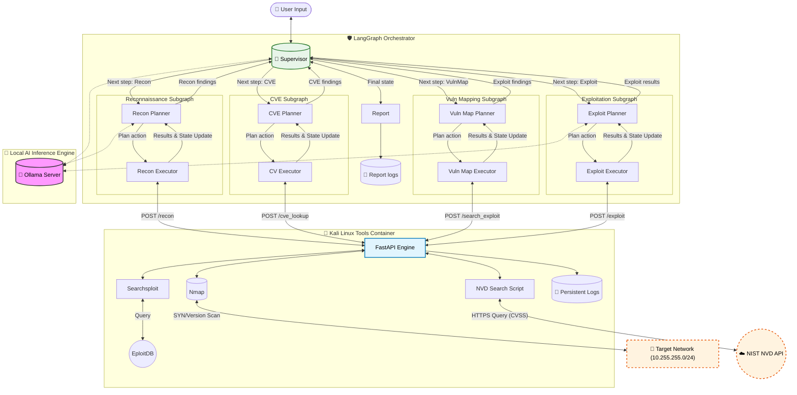

# Agentic Security Orchestrator

A containerized, multi‑agent cyber‑security framework built using **LangGraph**, **Ollama**, and a modular *supervisor/worker/executor* architecture. This project is a Proof of Concept and one of my Master's Theses.

This project provides a controlled environment where AI agents help to perform:

*   **Reconnaissance**
*   **Scanning**
*   **Service fingerprinting**
*   **CVE association**
*   **Exploitation workflows**
*   **Final Report Generation**

All operations occur inside a fully isolated Docker network using a hardened Kali engine.

***

## 🚀 Overview

The system uses **LangGraph subgraphs** to coordinate separate reasoning loops for:

*   **Reconnaissance** — network scanning, host discovery, port mapping, service versioning, HTTP lookups.
*   **CVE lookups** — CVE lookups in NVD v2.0.
*   **Vulnerability mapping** — CVE to exploit mapping via ExploitDB and Metasploit Framework searches.
*   **Exploitation** — controlled follow-up actions based on recon findings.
*   **Report** — Final report summarizing the whole execution and the results found.

A central **Supervisor Agent** coordinates the workflow

### Graphic representation


```mermaid
graph TD
    classDef ai fill:#f9f,stroke:#333,stroke-width:2px,color:#000;
    classDef container fill:#e1f5fe,stroke:#0277bd,stroke-width:2px,color:#000;
    classDef external fill:#fff3e0,stroke:#e65100,stroke-width:2px,stroke-dasharray: 5 5,color:#000;
    classDef state fill:#e8f5e9,stroke:#2e7d32,stroke-width:2px,color:#000;

    User(["👤 User Input"]) <--> Supervisor

    subgraph "🛡️ LangGraph Orchestrator"
        Supervisor[("🧠 Supervisor")]:::state
        
        subgraph "Reconnaissance Subgraph"
            ReconPlanner["Recon Planner"]
            ReconExec["Recon Executor"]
        end

        subgraph "CVE Subgraph"
            CvePlanner["CVE Planner"]
            CveExec["CV Executor"]
        end

        subgraph "Vuln Mapping Subgraph"
            VulnMapPlanner["Vuln Map Planner"]
            VulnMapExec["Vuln Map Executor"]
        end
        
        subgraph "Exploitation Subgraph"
            ExploitPlanner["Exploit Planner"]
            ExploitExec["Exploit Executor"]
        end

        Supervisor --"Next step: Recon"--> ReconPlanner
        Supervisor --"Next step: CVE"--> CvePlanner
        Supervisor --"Next step: VulnMap"--> VulnMapPlanner
        Supervisor --"Next step: Exploit"--> ExploitPlanner
        
        ReconPlanner --"Recon findings"--> Supervisor
        CvePlanner --"CVE findings"--> Supervisor
        VulnMapPlanner --"Exploit findings"--> Supervisor
        ExploitPlanner --"Exploit results"--> Supervisor
        
        ReconPlanner --"Plan action"--> ReconExec
        CvePlanner --"Plan action"--> CveExec
        VulnMapPlanner --"Plan action"--> VulnMapExec
        ExploitPlanner --"Plan action"--> ExploitExec
        
        ReconExec --"Results & State Update"--> ReconPlanner
        CveExec --"Results & State Update"--> CvePlanner
        VulnMapExec --"Results & State Update"--> VulnMapPlanner
        ExploitExec --"Results & State Update"--> ExploitPlanner

        ReportNode["Report"]
        ReportLogs[("📂 Report logs")]
        Supervisor <--"Final state"--> ReportNode
        ReportNode --> ReportLogs
    end

    subgraph "🤖 Local AI Inference Engine"
        Ollama[("🦙 Ollama Server")]:::ai
    end

    Supervisor <.-> Ollama
    ReconPlanner <.-> Ollama
    ExploitPlanner <.-> Ollama

    subgraph "🐉 Kali Linux Tools Container"
        KaliAPI["FastAPI Engine"]:::container
        Nmap[("Nmap")]
        NVDSearch["NVD Search Script"]
        ExploitSearch["Searchsploit"]
        Logs[("📂 Persistent Logs")]
        ExploitDB(("EploitDB"))
    end

    ReconExec <--"POST /recon"--> KaliAPI
    CveExec <--"POST /cve_lookup"--> KaliAPI
    VulnMapExec <--"POST /search_exploit"--> KaliAPI
    ExploitExec <--"POST /exploit"--> KaliAPI

    KaliAPI <--> Nmap
    KaliAPI <--> NVDSearch
    KaliAPI <--> ExploitSearch
    KaliAPI --> Logs

    Target["🎯 Target Network (10.255.255.0/24)"]:::external
    NVD_API(("☁️ NIST NVD API")):::external

    Nmap <--"SYN/Version Scan"--> Target
    NVDSearch <--"HTTPS Query (CVSS)"--> NVD_API
    ExploitSearch <--"Query"--> ExploitDB
```

***

## 🧱 Architecture

### **1. Orchestrator (main agent environment)**

Runs:

*   LangGraph supervisor
*   Worker planner(s)
*   Message/step routing
*   Structured LLM calls to perform recon/exploit decisions
*   Subgraphs for autonomous internal reasoning and executions
*   Final report generation with findings

### **2. Kali Engine (Recon + Exploit tools)**

A hardened container that:

*   Executes Network mapper, CVE lookups, exploit searches, exploit executions and tools.
*   Applies firewalling to ensure:
    *   Only target hosts are reachable
    *   Gateway and self are blocked
*   Receives tool execution requests via REST API

### **3. Vulnerable Targets**

Isolated inside `attack_net`:

*   Reachable only by Kali Engine
*   Never visible to orchestrator
*   Discoverable by recon subgraph

### **4. LangGraph Subgraphs**

*   **Recon Subgraph**
    *   Planner → Executor loop
    *   Step-by-step scanning
    *   Tool selection enforced by structured schema
    *   Handles full cycle:
        *   CIDR → host discovery → port map → version scans → HTTP lookups → summary
    *   Uses recon AI agents

*   **CVE Subgraph**
    *   Planner → Executor loop
    *   Step-by-step searches
    *   CVE lookup based on Recon findings (services and versions of each target)
    *   Fully deterministic

*   **Vuln Map Subgraph**
    *   Planner → Executor loop
    *   Step-by-step searches
    *   Vulnerability to Exploit mapping based on Recon findings and found CVEs (services and versions of each target)
    *   Fully deterministic

*   **Exploit Subgraph**
    *   Planner → Executor loop
    *   Planner selects exploit vector
    *   Executor performs exploits selecting found exploits or available tools
    *   Produces structured findings
    *   Uses exploit AI agents

***

## 🔍 Recon Capabilities

* Full network scan
* Automatic exclusion of gateway & self
* Planner-driven version scanning
* Full reasoning loop until no pending hosts
* Clean recon summary output to user

***

## 🔧 Development Roadmap

### Completed

*   Recon subgraph with planner/executor loop
*   LangGraph integration
*   Supervisor loop implementation
*   Host mapping and version scanning
*   Final Summary Node to generate report of findings
*   Exploit search by Exploit Subgraph
*   Graph refactoring to modularize nodes
*   Knowledge persistence integration
*   Human-in-the-Loop integration
*   Automatic mitigation suggestions
*   Exploit usage
*   Vulhub targets tested

### Available improvements in the short term

*   Recon improvements to detect Web Apps and their versions more reliably
*   Exploit subgraph improvements to be able to launch exploits in more ways
*   Exploit subgraph improvements to be able to perform more actions than just launch exploits

# Possible future work

*   Dedicated GUI
*   Multi-vector exploit reasoning
*   Safe-mode vs aggressive-mode flags
*   Interactive chain-of-thought debugging
*   Attack graph generation

***

## 🛠 Prerequisites (Not updated yet)

Before running the orchestrator, ensure your environment meets the following requirements:

### 🖥 Operating System

* **Linux:** Recommended for native Docker performance.
* **Windows:** Must have **WSL2 (Windows Subsystem for Linux)** installed and configured as the default Docker backend.

### 🐳 Containerization

* **Docker Desktop** (Windows/Mac) or **Docker Engine** (Linux).
* **Docker Compose v2.0+**: Essential for managing the multi-container architecture (Orchestrator, Kali Engine, and Database).

### 🧠 Local AI (LLM)

The system uses **Ollama** to run models locally, ensuring data privacy and zero API costs.

1. **Install Ollama:** Follow instructions at [ollama.com](https://ollama.com).
2. **Pull Required Models:** Run the following command in your terminal:
```bash
ollama pull qwen2.5:7b  # Or the specific model configured in your .env

```

### 🧰 Optional Tooling

For convenience, a **Makefile** is provided to simplify deployment and lifecycle management.

3. **Service Status:** Ensure Ollama is running on the host. The orchestrator connects via `http://host.docker.internal:11434`.

### 📂 File System & Permissions

The orchestrator requires write permissions to persist intelligence data:

* **Reports Directory:** `/data/reports/` for automated security assessments.
* **Logging Directory:** `/data/logs/` for automated security assessments.
* *Note: If running on Linux, ensure the user has UID 1000 permissions or use `chmod` to allow container writes.*

### 🌐 Network Configuration

* The system creates two dedicated internal bridge networks (**10.255.254.0/24**, **10.255.255.0/24**). Ensure no local firewall rules (like `iptables` or Windows Firewall) block traffic between Docker containers and the host's Ollama port (11434).

***

## ▶️ Deployment Modes

The project supports multiple execution modes depending on your needs, from lightweight operation to full observability.

### 🔹 Core Engine Only

Command:

```bash
make core
```

Starts the minimal system required to operate the orchestrator:

*   **Orchestrator API**
*   **Kali execution engine**

No vulnerable targets and no monitoring stack are deployed.

✅ Lowest resource usage  
✅ Recommended for development and lightweight environments  
✅ Suitable for machines with limited RAM / VRAM

***

### 🔹 Core + Vulnerable Targets

Command:

```bash
make lab
```

Starts the core system **plus intentionally vulnerable targets** for attack simulation.

Includes:

*   Core services (`orchestrator`, `kali-engine`)
*   Vulnerable containers (e.g. **Metasploitable2**) attached to the internal attack network

✅ Enables end-to-end attack simulation  
✅ Useful for testing recon, exploitation and reporting phases  
✅ Still lightweight — no monitoring infrastructure

***

### 🔹 Core + Targets + Monitoring

Command:

```bash
make full
```

Starts the **complete stack**, including **observability and monitoring**.

Includes:

*   Core services
*   Vulnerable targets
*   **Langfuse monitoring stack** (web, worker, database, queue, storage)

✅ Full execution visibility and trace analysis  
✅ Recommended for debugging, benchmarking and prompt tuning  
⚠️ Higher resource consumption (RAM and storage)

Monitoring components are **optional** and not required for normal operation.

***

## ⛔ Stopping and Cleanup

```bash
make down
```

Stops all running containers.

```bash
make clean
```

Stops and removes containers, networks and orphaned services.  
Recommended when changing execution modes or network topology.

### Controlling the execution

Send an HTTP POST request to `http://localhost:8000/chat`. Example using the client provided:

    python .\client.py "Please scan the network 10.255.255.0/24 for vulnerabilities" -f

Or you can use the Swagger UI deployed in http://localhost:8000/docs, where there are more options to try.

The system currently stops before each subgraph. You can ask questions to the model to analyze the current state, or you can continue the execution by sending "approve" to the model:

    python .\client.py "approve"

***

## 📄 License

MIT License.
